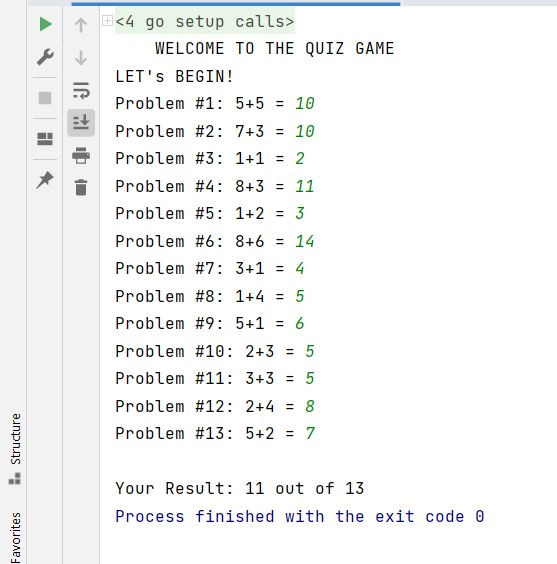
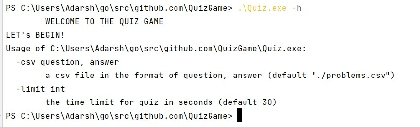
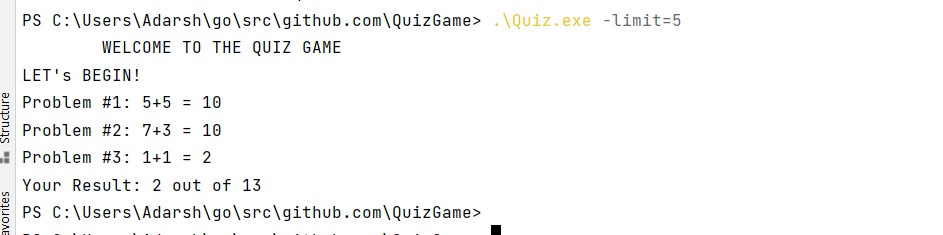

# Quiz-Game-GO
CLI timed quiz game parsed from csv file in GOLANG

- Read the quiz provided via a CSV file and will then give the quiz to a user keeping track of how many questions they get right and how many they get incorrect.

<kbd></kbd>

- Executable file should run on by own on CMD and --help should provide directions.

<kbd></kbd>

- The default time limit is 30 seconds, but also customizable via a flag.

<kbd></kbd>
